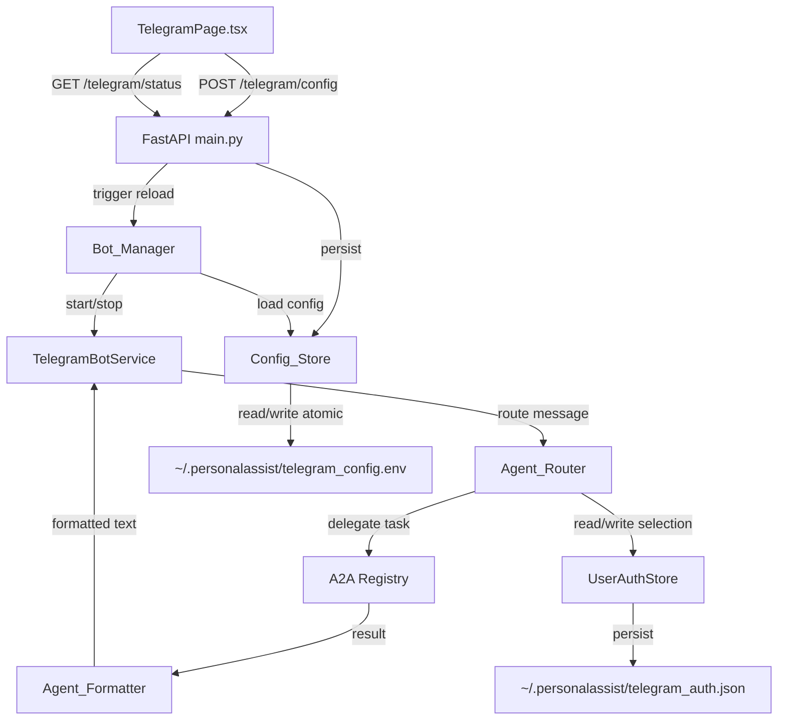
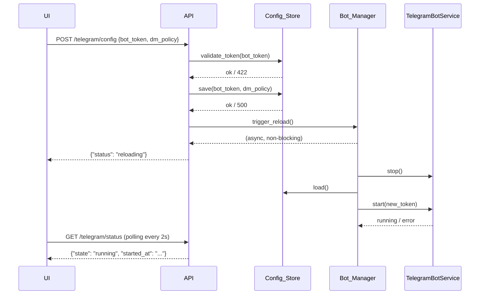
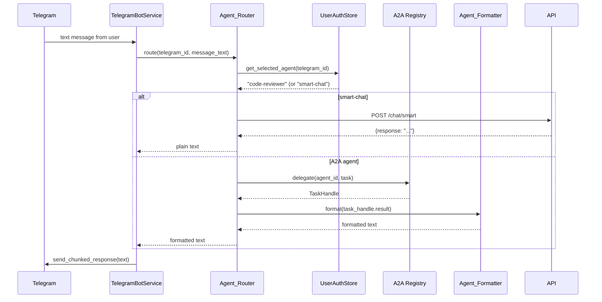

# Design Document: telegram-bot-config-reload

## Overview

This feature closes four gaps in the current Telegram integration:

1. `POST /telegram/config` validates but never saves the bot token
2. `TelegramBotService` reads `TELEGRAM_BOT_TOKEN` once at startup and cannot pick up changes
3. The UI shows a static "restart required" warning even though nothing was saved
4. There is no way to query the current bot state from the UI

The solution introduces three new modules (`Config_Store`, `Bot_Manager`, `Agent_Router`, `Agent_Formatter`), refactors `TelegramBotService` to support lifecycle management, extends the API with status and reload endpoints, and updates the UI to show real-time bot status with polling.

---

## Architecture



**Request flow — config save → reload:**



**Request flow — message → agent routing:**



---

## Components and Interfaces

### Config_Store (`packages/messaging/config_store.py`)

Responsible for reading and writing `~/.personalassist/telegram_config.env`.

```python
class Config_Store:
    CONFIG_PATH: Path  # ~/.personalassist/telegram_config.env
    TOKEN_PATTERN: re.Pattern  # ^\d+:[A-Za-z0-9_-]{35,}$

    def validate_token(self, token: str) -> bool: ...
    def load(self) -> TelegramConfig: ...
    def save(self, token: str | None, dm_policy: str) -> None: ...
        # atomic: write to .tmp then os.replace()
        # if token is None or empty, preserve existing token
```

### Bot_Manager (`packages/messaging/bot_manager.py`)

Singleton that owns the `TelegramBotService` lifecycle. Integrates with FastAPI lifespan.

```python
class BotState(str, Enum):
    STOPPED = "stopped"
    STARTING = "starting"
    RUNNING = "running"
    RELOADING = "reloading"
    ERROR = "error"

class Bot_Manager:
    _instance: Bot_Manager | None  # singleton
    state: BotState
    started_at: datetime | None
    error_message: str | None
    _lock: asyncio.Lock  # debounce concurrent reloads
    _bot: TelegramBotService | None

    async def startup(self) -> None: ...   # called from lifespan
    async def shutdown(self) -> None: ...  # called from lifespan
    async def trigger_reload(self) -> None: ...  # debounced, 2s window
    async def apply_policy(self, dm_policy: str) -> None: ...
    def get_status(self) -> BotStatus: ...

def get_bot_manager() -> Bot_Manager: ...
```

### Agent_Router (`packages/messaging/agent_router.py`)

Maps Telegram messages to the correct agent endpoint.

```python
SMART_CHAT_AGENT_ID = "smart-chat"

class Agent_Router:
    def __init__(self, auth_store: UserAuthStore, registry: A2ARegistry): ...

    async def route(
        self,
        telegram_id: str,
        message: str,
        update: Update,
    ) -> str: ...
        # returns formatted response text

    def set_agent(self, telegram_id: str, agent_id: str) -> None: ...
    def get_agent(self, telegram_id: str) -> str: ...  # defaults to "smart-chat"
    def reset_agent(self, telegram_id: str) -> None: ...
    def list_agents(self) -> list[AgentInfo]: ...
```

### Agent_Formatter (`packages/messaging/agent_formatter.py`)

Converts A2A JSON results to readable Telegram text.

```python
SEVERITY_ORDER = ["critical", "high", "medium", "low", "info"]

class Agent_Formatter:
    def format_result(self, agent_id: str, result: dict) -> str: ...
    def format_error(self, agent_id: str, error: str) -> str: ...
    def _format_findings(self, findings: list[dict]) -> str: ...
    def _format_scores(self, score: dict) -> str: ...
    def _format_recommendations(self, recs: list[str]) -> str: ...
    def _format_metrics(self, metrics: dict) -> str: ...
```

### TelegramBotService (refactored)

Token and DM policy become constructor parameters. Lifecycle methods added.

```python
class TelegramBotService:
    def __init__(self, token: str, dm_policy: str = "pairing"): ...
    async def start(self) -> None: ...   # initialize + begin polling
    async def stop(self) -> None: ...    # stop polling + shutdown
    async def set_dm_policy(self, policy: str) -> None: ...
    # existing handlers: start_command, help_command, status_command, new_command
    # new handlers: agents_command, agent_command
    # existing: handle_message, send_chunked_response
```

### Token Redaction

A `logging.Filter` subclass `TelegramTokenFilter` is added to both `telegram_bot.py` and `bot_manager.py` loggers. It replaces any string matching the token pattern with `[REDACTED]` in log records.

---

## Data Models

### TelegramConfig

```python
@dataclass
class TelegramConfig:
    bot_token: str        # may be empty string if not yet set
    dm_policy: str        # "pairing" | "allowlist" | "open"
```

### BotStatus (API response shape)

```python
class BotStatus(BaseModel):
    state: Literal["stopped", "starting", "running", "reloading", "error"]
    started_at: str | None = None   # ISO-8601, present when state == "running"
    error_message: str | None = None  # present when state == "error"
```

### ConfigSaveRequest / ConfigSaveResponse

```python
class ConfigSaveRequest(BaseModel):
    bot_token: str = ""
    dm_policy: str = "pairing"

class ConfigSaveResponse(BaseModel):
    status: Literal["reloading", "saved"]  # "reloading" if token changed
    message: str
```

### UserAuthStore extension

The existing `telegram_auth.json` entry gains one optional field:

```json
{
  "telegram_id": "123456789",
  "user_id": "default",
  "approved": true,
  "created_at": "2024-01-01T00:00:00",
  "last_message_at": null,
  "selected_agent": "smart-chat"
}
```

`selected_agent` defaults to `"smart-chat"` when absent.

### AgentInfo (for /agents command)

```python
@dataclass
class AgentInfo:
    agent_id: str
    name: str
    description: str
```

---

## API Endpoint Specifications

### GET /telegram/status

Returns current bot state.

**Response 200:**
```json
{
  "state": "running",
  "started_at": "2024-01-15T10:30:00.000Z",
  "error_message": null
}
```

**Response fields:**
- `state`: one of `"stopped"`, `"starting"`, `"running"`, `"reloading"`, `"error"`
- `started_at`: ISO-8601 string, present only when `state == "running"`
- `error_message`: string, present only when `state == "error"`

### POST /telegram/config (updated)

Persists config and triggers reload.

**Request:**
```json
{
  "bot_token": "123456:ABC-DEF1234ghIkl-zyx57W2v1u123ew11",
  "dm_policy": "pairing"
}
```

**Response 200 — token changed:**
```json
{"status": "reloading", "message": "Bot is reloading with new token..."}
```

**Response 200 — policy-only change:**
```json
{"status": "saved", "message": "Configuration saved."}
```

**Response 422 — invalid token:**
```json
{"detail": "Invalid bot token format. Expected: \\d+:[A-Za-z0-9_-]{35,}"}
```

**Response 500 — write failure:**
```json
{"detail": "Failed to write config: <reason>"}
```

### GET /health/telegram

Lightweight health check for the bot subsystem.

**Response 200:**
```json
{"status": "ok", "bot_state": "running"}
```

---

## Correctness Properties

*A property is a characteristic or behavior that should hold true across all valid executions of a system — essentially, a formal statement about what the system should do. Properties serve as the bridge between human-readable specifications and machine-verifiable correctness guarantees.*

### Property 1: Config_Store round-trip

*For any* valid bot token (matching `^\d+:[A-Za-z0-9_-]{35,}$`), writing it via `Config_Store.save()` and then reading it back via `Config_Store.load()` shall produce a token equal to the original written value.

**Validates: Requirements 1.1, 5.1**

---

### Property 2: Empty token preserves existing

*For any* config file containing a valid token T, calling `Config_Store.save(token="", dm_policy=p)` and then reading back shall return token T unchanged (only the DM policy is updated).

**Validates: Requirements 1.2**

---

### Property 3: Config load priority

*For any* valid token written to `~/.personalassist/telegram_config.env`, `Config_Store.load()` shall return that token regardless of the value of the `TELEGRAM_BOT_TOKEN` environment variable.

**Validates: Requirements 1.3**

---

### Property 4: Token not logged in plaintext

*For any* valid bot token, after calling `Config_Store.save()` or `Bot_Manager.trigger_reload()`, no log record emitted at INFO level or above shall contain the token string in plaintext.

**Validates: Requirements 1.4**

---

### Property 5: Token validation rejects invalid tokens

*For any* string that does not match `^\d+:[A-Za-z0-9_-]{35,}$`, `Config_Store.validate_token()` shall return `False`; *for any* string that does match, it shall return `True`.

**Validates: Requirements 5.2**

---

### Property 6: Status endpoint always returns a valid state

*For any* call to `GET /telegram/status`, the response `state` field shall be one of `{"stopped", "starting", "running", "reloading", "error"}`.

**Validates: Requirements 3.1**

---

### Property 7: Agent selection round-trip

*For any* Telegram user ID and any valid agent ID, calling `Agent_Router.set_agent(telegram_id, agent_id)` followed by `Agent_Router.get_agent(telegram_id)` shall return the same agent ID — and this selection shall survive a `UserAuthStore` reload from disk.

**Validates: Requirements 6.2, 6.7**

---

### Property 8: Agent routing correctness

*For any* Telegram user with a stored agent selection S, `Agent_Router.route()` shall invoke the agent identified by S; *for any* user with no stored selection, `Agent_Router.route()` shall invoke `"smart-chat"`.

**Validates: Requirements 6.4**

---

### Property 9: Agent selection reset

*For any* Telegram user with any stored agent selection, calling `Agent_Router.reset_agent(telegram_id)` and then `Agent_Router.get_agent(telegram_id)` shall return `"smart-chat"`.

**Validates: Requirements 6.5**

---

### Property 10: Agent_Formatter comprehensive formatting

*For any* valid A2A agent result object containing any combination of `findings`, `summary`, `score`, `recommendations`, and `metrics`:
- All finding severities present in the input shall appear in the formatted output
- The summary string (if present) shall appear before any findings in the output
- All score field names and values shall appear in the output
- All recommendation strings shall appear as bullet points in the output
- All metric key-value pairs shall appear in the output
- Critical and high severity findings shall appear before medium, low, and info findings

**Validates: Requirements 7.1, 7.2, 7.3, 7.4, 7.5, 7.8**

---

### Property 11: /agents command lists all registered agents

*For any* set of agents registered in the A2A registry, the text produced by the `/agents` command handler shall contain every registered agent's ID and name.

**Validates: Requirements 6.1**

---

## Error Handling

| Scenario | Component | Behavior |
|---|---|---|
| Config file write fails | Config_Store | Raises `ConfigWriteError`; API returns HTTP 500 |
| Invalid token format | Config_Store | Returns `False` from `validate_token`; API returns HTTP 422 |
| Bot fails to start (bad token) | Bot_Manager | Sets `state = "error"`, stores `error_message` |
| A2A delegate times out (>60s) | Agent_Router | Catches `asyncio.TimeoutError`; replies with agent ID + "timed out" |
| A2A delegate raises exception | Agent_Router | Catches exception; replies with agent ID + error string |
| Unknown agent ID in `/agent` | TelegramBotService | Replies with error listing valid agent IDs |
| Formatted output >4096 chars | Agent_Formatter | Delegates to `send_chunked_response` |
| Bot_Manager reload while already reloading | Bot_Manager | `asyncio.Lock` debounce: second call waits for lock, then checks if reload still needed |

**Token redaction:** `TelegramTokenFilter` is a `logging.Filter` that replaces any occurrence of the current token in log record messages with `[REDACTED]`. It is attached to the `packages.messaging.telegram_bot` and `packages.messaging.bot_manager` loggers at module initialization.

---

## Testing Strategy

### Unit Tests

Unit tests cover specific examples, edge cases, and error conditions:

- `Config_Store.validate_token` with known valid and invalid token strings
- `Config_Store.save` with empty token (verify existing token preserved)
- `Config_Store.save` failure (mock `os.replace` to raise; verify `ConfigWriteError`)
- `Bot_Manager.get_status` returns correct shape for each state
- `Agent_Router.route` with no prior selection routes to `smart-chat`
- `Agent_Router.route` with unknown agent falls back gracefully
- `Agent_Formatter.format_error` includes agent ID and error string
- `Agent_Formatter` output >4096 chars triggers chunking
- `/agent <invalid_id>` command replies with valid agent list
- API `POST /telegram/config` returns 422 for invalid token
- API `POST /telegram/config` returns 500 on write failure
- API `GET /telegram/status` returns `error_message` when state is `"error"`

### Property-Based Tests

Property-based tests use **Hypothesis** (Python) to verify universal properties across many generated inputs. Each test runs a minimum of **100 iterations**.

Each test is tagged with a comment in the format:
`# Feature: telegram-bot-config-reload, Property <N>: <property_text>`

**Property 1 — Config_Store round-trip**
```python
# Feature: telegram-bot-config-reload, Property 1: Config_Store round-trip
@given(token=valid_token_strategy())
@settings(max_examples=200)
def test_config_store_round_trip(token, tmp_path):
    store = Config_Store(config_path=tmp_path / "telegram_config.env")
    store.save(token=token, dm_policy="pairing")
    loaded = store.load()
    assert loaded.bot_token == token
```

**Property 2 — Empty token preserves existing**
```python
# Feature: telegram-bot-config-reload, Property 2: Empty token preserves existing
@given(token=valid_token_strategy(), policy=st.sampled_from(["pairing", "allowlist", "open"]))
@settings(max_examples=100)
def test_empty_token_preserves_existing(token, policy, tmp_path):
    store = Config_Store(config_path=tmp_path / "telegram_config.env")
    store.save(token=token, dm_policy="pairing")
    store.save(token="", dm_policy=policy)
    loaded = store.load()
    assert loaded.bot_token == token
    assert loaded.dm_policy == policy
```

**Property 5 — Token validation**
```python
# Feature: telegram-bot-config-reload, Property 5: Token validation rejects invalid tokens
@given(token=st.text())
@settings(max_examples=500)
def test_token_validation_matches_pattern(token):
    store = Config_Store()
    expected = bool(re.match(r'^\d+:[A-Za-z0-9_-]{35,}$', token))
    assert store.validate_token(token) == expected
```

**Property 7 — Agent selection round-trip**
```python
# Feature: telegram-bot-config-reload, Property 7: Agent selection round-trip
@given(
    telegram_id=st.text(min_size=1),
    agent_id=st.sampled_from(["smart-chat", "code-reviewer", "workspace-analyzer"])
)
@settings(max_examples=200)
def test_agent_selection_round_trip(telegram_id, agent_id, tmp_path):
    auth_store = UserAuthStore(auth_file=tmp_path / "telegram_auth.json")
    router = Agent_Router(auth_store=auth_store, registry=mock_registry())
    router.set_agent(telegram_id, agent_id)
    # Reload store from disk to verify persistence
    auth_store2 = UserAuthStore(auth_file=tmp_path / "telegram_auth.json")
    router2 = Agent_Router(auth_store=auth_store2, registry=mock_registry())
    assert router2.get_agent(telegram_id) == agent_id
```

**Property 8 — Agent routing correctness**
```python
# Feature: telegram-bot-config-reload, Property 8: Agent routing correctness
@given(
    telegram_id=st.text(min_size=1),
    agent_id=st.sampled_from(["code-reviewer", "workspace-analyzer", "test-generator"])
)
@settings(max_examples=100)
async def test_routing_uses_selected_agent(telegram_id, agent_id):
    router = Agent_Router(auth_store=mock_auth_store(), registry=mock_registry())
    router.set_agent(telegram_id, agent_id)
    routed_to = await router.get_route_target(telegram_id)
    assert routed_to == agent_id
```

**Property 9 — Agent selection reset**
```python
# Feature: telegram-bot-config-reload, Property 9: Agent selection reset
@given(
    telegram_id=st.text(min_size=1),
    agent_id=st.sampled_from(["code-reviewer", "workspace-analyzer"])
)
@settings(max_examples=100)
def test_reset_returns_to_smart_chat(telegram_id, agent_id):
    router = Agent_Router(auth_store=mock_auth_store(), registry=mock_registry())
    router.set_agent(telegram_id, agent_id)
    router.reset_agent(telegram_id)
    assert router.get_agent(telegram_id) == "smart-chat"
```

**Property 10 — Agent_Formatter comprehensive formatting**
```python
# Feature: telegram-bot-config-reload, Property 10: Agent_Formatter comprehensive formatting
@given(result=agent_result_strategy())
@settings(max_examples=200)
def test_formatter_preserves_all_content(result):
    formatter = Agent_Formatter()
    text = formatter.format_result("code-reviewer", result)
    for finding in result.get("findings", []):
        assert finding["severity"] in text
        assert finding["message"] in text
    if "summary" in result:
        assert text.startswith(result["summary"][:50])
    for rec in result.get("recommendations", []):
        assert rec in text
    # Verify severity ordering: all critical/high before medium/low/info
    high_pos = max((text.find(f) for f in result.get("findings", [])
                    if f["severity"] in ("critical", "high")), default=-1)
    low_pos = min((text.find(f) for f in result.get("findings", [])
                   if f["severity"] in ("medium", "low", "info")), default=len(text))
    assert high_pos <= low_pos
```

**Property 11 — /agents lists all registered agents**
```python
# Feature: telegram-bot-config-reload, Property 11: /agents command lists all registered agents
@given(agent_ids=st.lists(st.text(min_size=1), min_size=1, max_size=10, unique=True))
@settings(max_examples=100)
async def test_agents_command_lists_all(agent_ids):
    registry = build_mock_registry(agent_ids)
    router = Agent_Router(auth_store=mock_auth_store(), registry=registry)
    agents_text = router.format_agents_list()
    for agent_id in agent_ids:
        assert agent_id in agents_text
```

### Integration Tests

- Full config save → reload cycle: write token, trigger reload, poll status until `"running"`
- DM policy change: verify bot is not restarted (stop not called)
- A2A delegate timeout: mock registry to sleep >60s, verify error reply contains agent ID
- Chunked response: generate result >4096 chars, verify multiple messages sent
